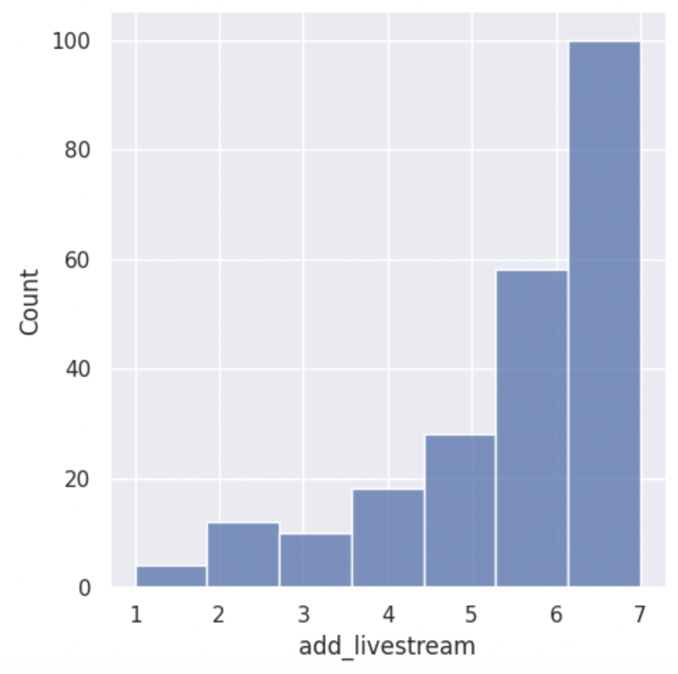
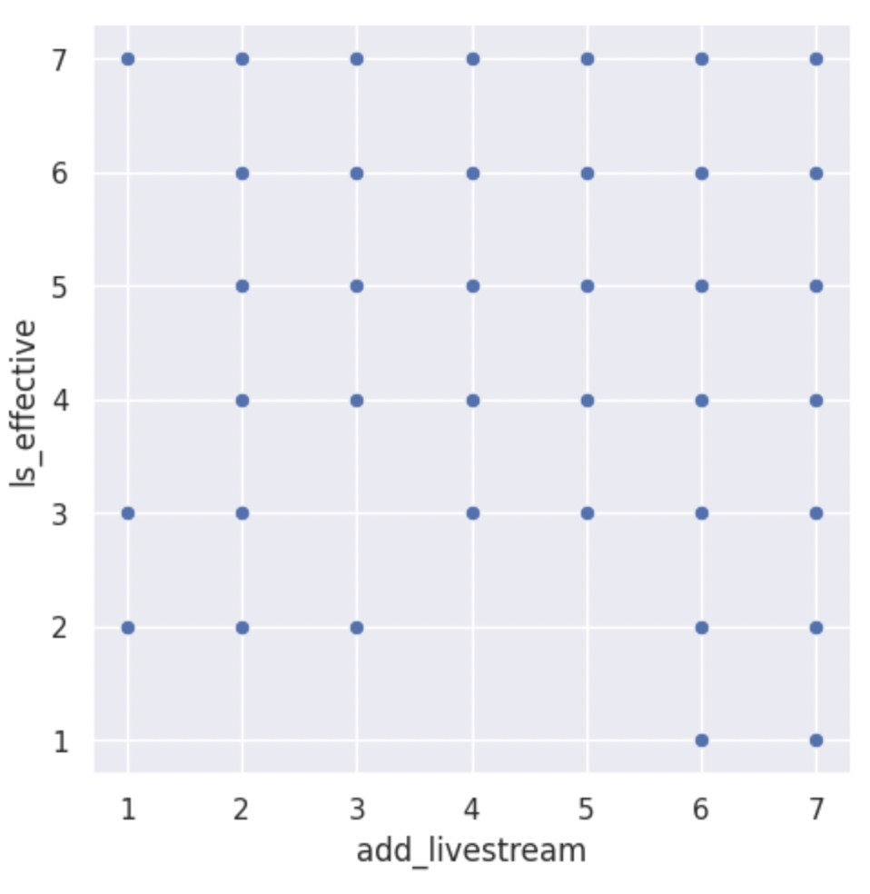
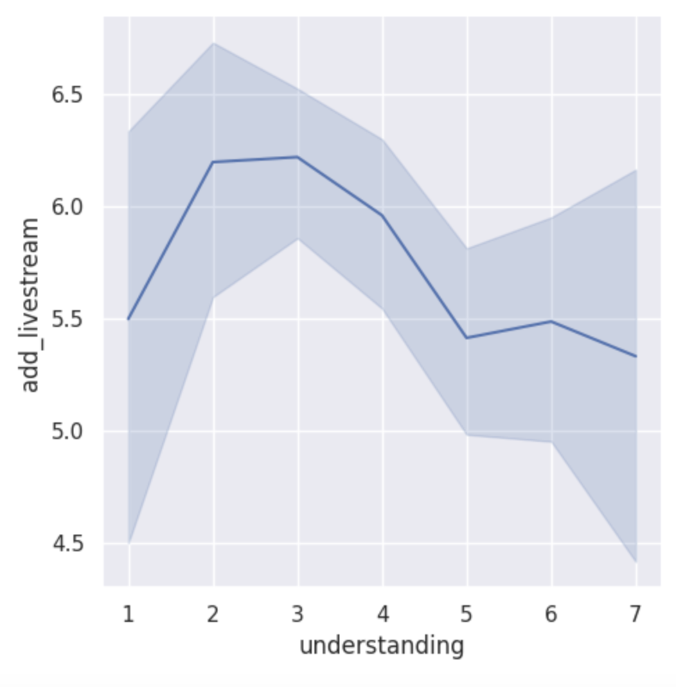

---
# Do not edit the text between these lines!
layout: default
---

# COMP 110 Data Analysis: Should lectures be livestreamed?

## Summary of Analysis:

For this analysis, I explored whether COMP110 should implement a livestream or recording option for class lectures. Using survey data collected from students enrolled in the course, I analyzed the add_livestream column, which asked students how strongly they agree that lectures should be livestreamed (1 indicating the Strongly Disagree and 7 indicating they Strongly Agree). I also used ls_effective and understanding to explore how other variables like lesson video effectiveness and student understanding relate to the demand for recorded lectures and also the impact that they would have.

## Visualizations:

## Chart 1: Distribution of Livestream Support

## Chart 2: Livestream Support vs Lesson Video Effectiveness

## Chart 3: Understanding vs Livestream Support

## Conclusion:

Summary of Findings:

My analysis of the survey data supports the idea that the course should record 
and livestream lectures for students who cannot attend in person. The histogram 
shows that a majority of students responded with a 6 or 7 on the add_livestream 
question, showing high demand from students. The scatter plot showed that 
students who find lesson videos effective also tend to support livestreaming, as the majority of the points were in the upper right corner. This result suggests that students value online recorded content in general as a learning tool. The line plot showed that  students with lower understanding scores tend to show higher support for livestreaming, suggesting that students who struggle would benefit most from 
being able to revisit lectures at their own pace.

Recommendation:

Through analyzing data from student responses, my recommendation is that the course should implement a livestream or recording option for in-person lectures going forward. 

Extensions and Refinements:

This analysis could be taken further by exploring how support for livestreaming class lectures is related to how much programming experience people have in the past. It can also be studied if people are commuting to class and it would be easire for them to tune in online. These areas could show why people want online lectures and also how to best serve both the experienced programmers and the beginners. 

Costs and Tradeoffs:

Instructional staff would be slightly negatively impacted by this change on the front end, just because they would need to set up the technology to record and post lecture material. However, they would receive the benefit of this by tailoring the course to meet a wider variety of student's learning needs. 
The Academic institution would be effected by this change because they would need to provide the right materials to allow the course to be recorded, such as recording technology in the classroom. 
There is also the possibility that recording lecture online will reduce in-person attendance, which can negatively impact the learning environment and student interraction, for those who do attend. 
Some students rely on the social interraction and peer support in courses for learning, which could be negatively impacted if student attendance drops. 
